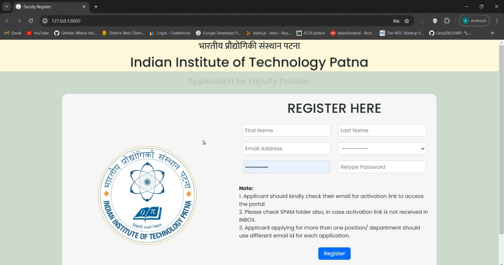
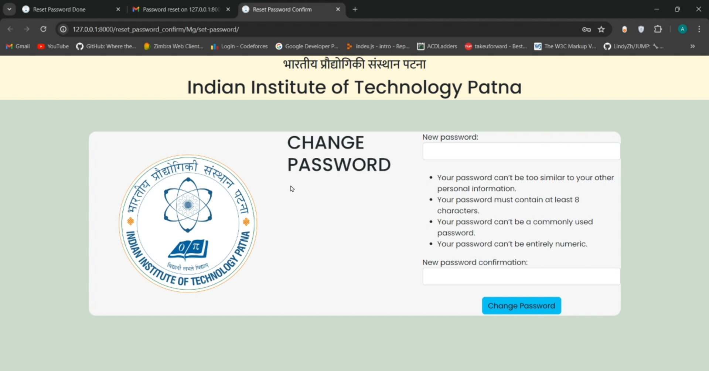
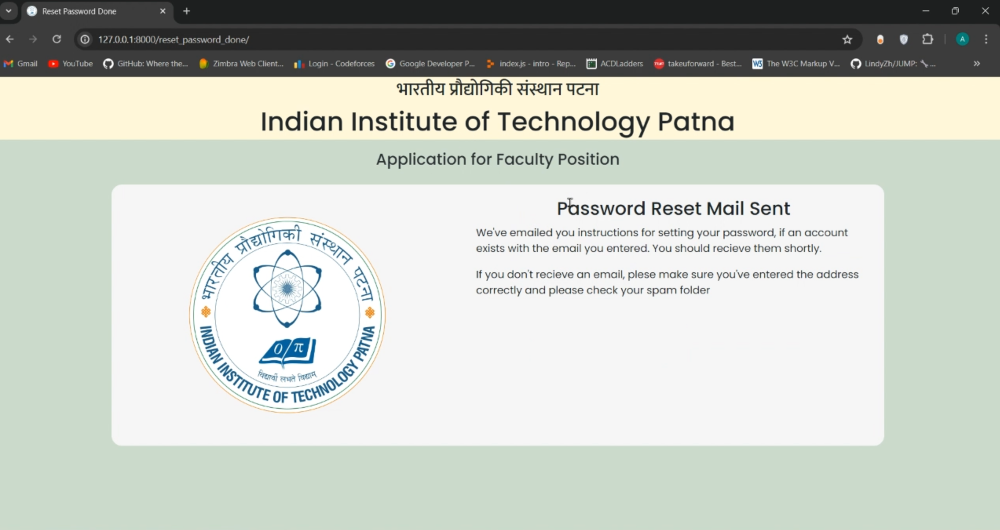
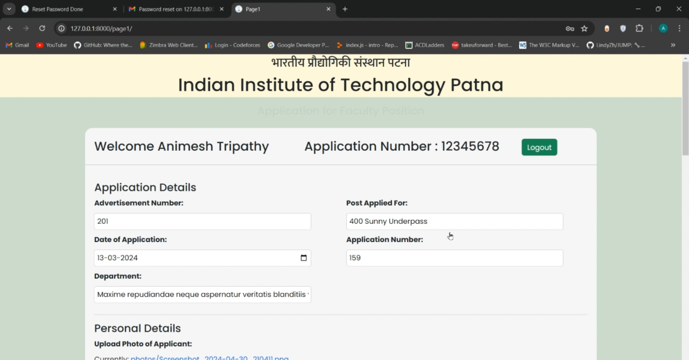
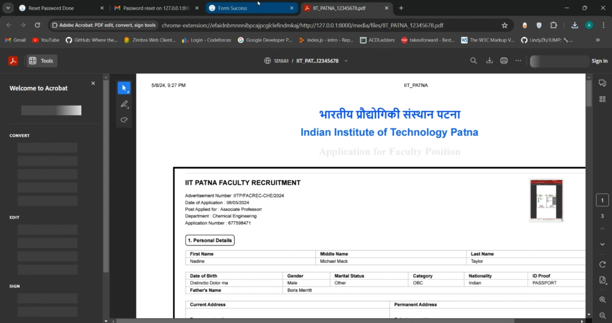
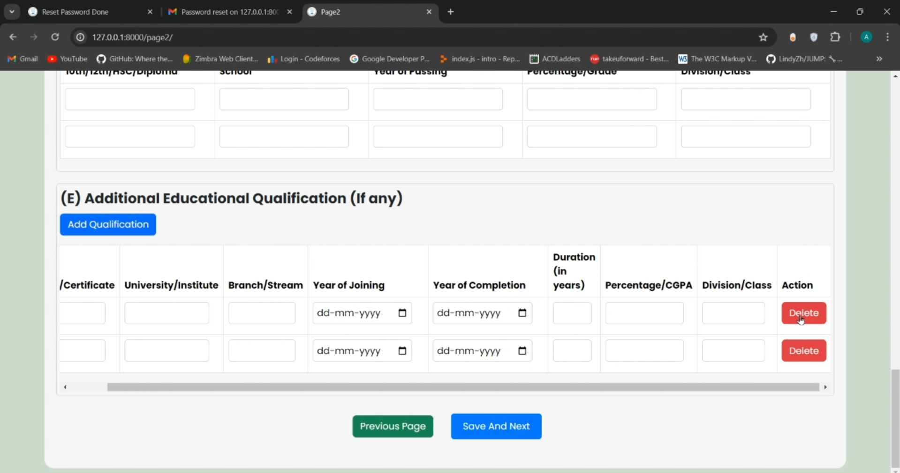
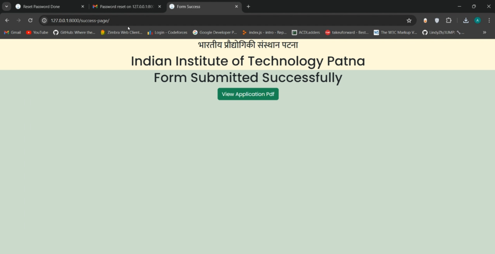

# DBMS_LAB_CS260_2024

## Portal - Faculty Recruitment Portal

Developed By:
- Animesh Tripathy (2201CS16)
- Aman Vaibhav Jha (2201AI54)

## Demo Video
[Watch the demo video](https://youtu.be/5sevJVAqKtE?si=IzWU9EMMsa4cpAEL)

## Super User Credentials
- Username: aa@gmail.com
- Email address: aa@gmail.com
- Password: password

## Project Overview
The Faculty Recruitment Portal is a web application designed to streamline the faculty recruitment process. It provides a platform for managing applications and candidate evaluations.

## How to Run the Project
### Method 1: Directly Run in Your Local Host
1. Clone or download the project folder into your local machine.
2. Navigate to the project directory.

    ```bash
    cd project_name/
    ```

3. Install the required dependencies listed in `requirements.txt`. You can use pip for this:

    ```bash
    pip install -r requirements.txt
    ```

4. Run the Django server using the following command:

    ```bash
    python manage.py makemigrations
    python manage.py migrate
    python manage.py runserver
    ```

5. Access the application by opening a web browser and visiting `http://localhost:8000`.

### Method 2: Using Docker
1. Clone or download the project folder into your local machine.
2. Navigate to the project directory.

    ```bash
    cd project_name/
    ```

3. Ensure Docker is installed on your system.
4. Build the Docker image using the provided Dockerfile:

    ```bash
    docker build -t portal .
    ```

5. Run the Docker container using the following command:

    ```bash
    docker run -p 8000:8000 portal
    ```

6. Access the application by opening a web browser and visiting `http://localhost:8000`.

## Project Structure
The project follows the standard Django application structure:

```
proj1/  
├── app/  
│   ├── __init__.py  
│   ├── admin.py  
│   ├── apps.py  
│   ├── models.py  
│   ├── tests.py  
│   ├── urls.py  
│   └── views.py  
├── portal_mysql/  
│   ├── __init__.py  
│   ├── settings.py  
│   ├── urls.py  
│   └── wsgi.py  
├── manage.py  
└── requirements.txt  
|__ Dockerfile  
|__ docker-compose.yml  
```

- The `app` directory contains the main application code including models, views, and URLs.
- The `portal_mysql` directory contains the project-level settings and configurations.
- `manage.py` is a command-line utility for interacting with the project.
- `requirements.txt` lists all Python dependencies required for the project.
- `Dockerfile` contains instructions to build the Docker image for the project.
- `docker-compose.yml` defines the services, networks, and volumes for Docker deployment.

## Screenshots

### Login Page


### Register Page


### Reset Password





### Application Form


### PDF Print


### Database


### Declaration Page


### Row Add Feature


### Success Page


## Contributors
- Animesh Tripathy
- Aman Vaibhav Jha
